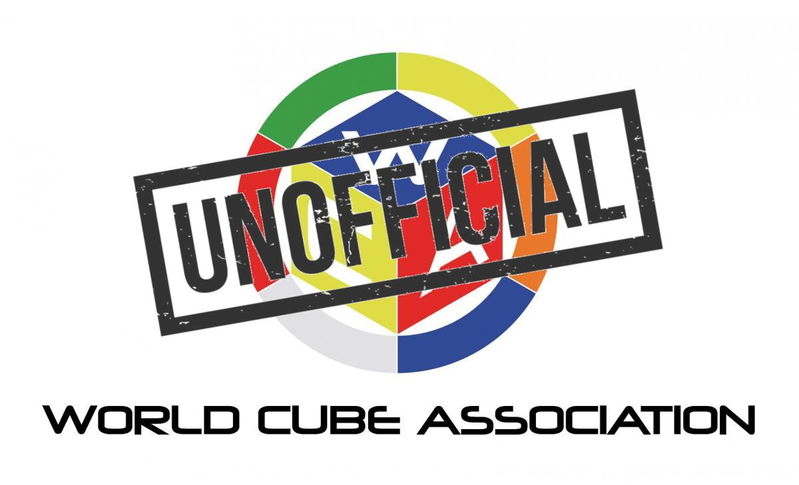

## Frequently Asked Questions (FAQ)

### Background

#### What are the senior rankings?

The [Senior Rankings](Senior_Rankings.html) are the best possible indication that I can provide of your “real” world ranking amongst your peers. Non-contiguous ranks are because of unlisted / unknown seniors but the overall rankings are very accurate due to the way that they are calculated.

#### Why was this project created?

Prior to my first competition, I was curious about what kind of times the over 40s were achieving in competition. I was quite active on the Speedsolving.com forum so I created a [thread](https://www.speedsolving.com/threads/how-fast-are-the-over-40s-in-competitions.54128/) listing the results of the people that I knew personally or who were well known in the community.

The original list of official results only contained 11 seniors but the list was up to 23 names within a week. Since its creation the senior rankings have continued to grow and have over 500 seniors listed as of Jan 2020. It was originally intended to be a one-off activity but has subsequently evolved into a somewhat elaborate project!

### Senior Rankings

#### How many seniors have competed officially?

As of Jan 2020 the number of people who have competed after turning 40 is around 2,000.

You can check the latest figures at the bottom of the [rankings](https://logiqx.github.io/wca-ipy/Senior_Rankings.html) page.

#### How do I get my name added?

I will require your WCA ID and DOB. If you are a member of Speedsolving.com then please provide your nickname as well.

Instructions for getting your name added to this website are on the [front page](README.md) of the website.

#### What results qualify for the senior rankings?

Only official results achieved after turning 40 are eligible for the over 40s rankings. The same principle applies to the over 50s, 60s, 70s, 80s rankings.

It is worth noting that results after turning 50 will apply to multiple age categories. For example, official results of a 68 year old competitor will be eligible for the over 40s, over 50s and over 60s rankings.

#### How accurate are the rankings?

The world rankings are extremely accurate because I know precisely where gaps exist in the list of known seniors. However the national and continental rankings enclosed by parenthesis should be taken with a large pinch of salt due to them being little more than vague approximations.

Any national / continental rankings without parenthesis can be assumed good but the NR / CR rankings inside parenthesis may be somewhat better or worse than is reality. The NR / CR calculation considers the number of faster people who are known to be missing in the world rankings. It's by no means not perfect but it's about the best that can be done with the available data.

### Future Competitions

The [Future Competitions](Future_Competitions.html) page is updated throughout the day using the [WCA API](https://github.com/thewca/worldcubeassociation.org/wiki) and a number of additional websites that are used for competition registration.

It retrieves registration data from [worldcubeassociation.org](https://www.worldcubeassociation.org/competitions), [cubingchina.com](https://cubingchina.com/competition), [cubing-tw.net](https://cubing-tw.net/event/), [zawody4event.pl](https://zawody4event.pl/#competitions), [speedcubing.pl](https://www.speedcubing.pl/), [speedcubing.nz](https://www.speedcubing.nz/), [canadiancubing.com](http://www.canadiancubing.com/Events) and [cubecomp.de](https://cubecomp.de/)

### Technical

#### What data do the senior rankings use?

In addition to the public [WCA result export](https://www.worldcubeassociation.org/results/misc/export.html) the rankings use a bespoke [summary extract](https://github.com/Logiqx/wca-ipy/blob/master/sql/extract_senior_groups.sql) which is provided by the WCA results team. The summary extract does not identify individual competitors but it does allow the senior rankings to be padded out where there are gaps in the list of known seniors.

#### What is your data privacy policy?

The data privacy policy is described in the [Privacy Notice](Privacy_Notice.md).

In a nutshell, we are committed to keeping your DOB well protected and it will never be given out or published by this project.

#### How often is this website updated?

The senior rankings are updated daily using the WCA [results export](https://www.worldcubeassociation.org/results/misc/export.html) which is published at around 0400 GMT. A daily batch job runs at 0410 GMT which downloads the latest WCA database export and refreshes the senior rankings.

The "[Future Competitions](Future_Competitions.html)" page is updated every 3 hours - 0000 GMT, 0300 GMT, 0600 GMT, etc. This ensures that any registration changes are reflected promptly without the process being overly excessive.

#### What  Technologies are Used?

Data Wrangling: [MariaDB](https://mariadb.org/), [SQL](https://en.wikipedia.org/wiki/SQL), [Python](https://www.python.org/)

Web: [GitHub Pages](https://pages.github.com/), [HTML](https://en.wikipedia.org/wiki/HTML), [JavaScript](https://en.wikipedia.org/wiki/JavaScript)

Infrastructure: [AWS](https://aws.amazon.com/), [Docker](https://www.docker.com/), [Terraform](https://www.terraform.io/)

SCM + CI/CD: [Git](https://git-scm.com/), [GitHub](https://github.com/), [Jenkins](https://jenkins.io/)

Although the majority of the [project code](https://github.com/Logiqx/wca-ipy) can be found on GitHub it cannot be run without the private data.
