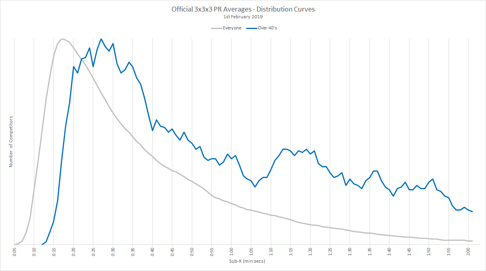

# SQL Extracts

## Background

If you look at the distribution of PRs for any given event you'll see something resembling a lognormal distribution. The image below is for 3x3x3 averages and shows two different PR distributions (all competitors VS senior competitors) when plotted to the same scale and overlaid as way of comparison.

It should be noted that the grey line shows the entire WCA community and is a near-perfect lognormal distribution. I've used this knowledge to create unique profiles for each WCA event, generating bins / buckets that contain at least 100 competitors, aiming for between 150-250 competitors on average.

The binning is achieved by reducing the precision of results through bit masking. The level of precision is dictated by the underlying distribution of the data and the associated number of competitors. I won't describe how I created the profiles in any detail since it is beyond the scope of this document.




### Bit Masking

Bit masking allows specific binary digits to be set to either 1's or 0's. In the context of these SQL scripts the bit masking is used to clear the least-significant bits of WCA results.

There are numerous ways that bit masks can be implemented in SQL but I have used an approach which makes the event profiles easier to read and maintain.

For example the number of bits to be masked for 3x3x3 averages is defined as follows:

```
CASE
    WHEN best < 768 THEN 10
    WHEN best < 832 THEN 6
    WHEN best < 896 THEN 5
    WHEN best < 1024 THEN 4
    WHEN best < 3968 THEN 3   -- midpoint
    WHEN best < 5952 THEN 4
    WHEN best < 7488 THEN 5
    WHEN best < 9088 THEN 6
    WHEN best < 10752 THEN 7
    WHEN best < 12800 THEN 8
    WHEN best < 14336 THEN 9
    WHEN best < 16384 THEN 10
    WHEN best < 20480 THEN 11
    WHEN best < 24576 THEN 12
    ELSE @max_shift
END
```

Looking at the 3x3x3 profile it can be seen that more bits are masked for the slowest and fastest times. The most common range of times (10.24s to 39.68s) can be seen to lose the least precision (3 bits - essentially rounding down to the nearest 0.08s). Everyone with a time less than 7.68 is rounded down to zero and everyone with a time of less than 8.32 is rounded down to 7.68.

To generate the actual bit mask from the number of bits to be blanked / zeroed:

1. Generate the "inverse"  bit mask by shifting a single bit left by the specified number of bits and subtracting 1.
2. Invert the result of step 1, flipping 1s to 0s and vice-versa to give the final bit mask.

Given @shift which is the number of bits to be blanked / cleared the following SQL performs these steps:

```
@mask := (1 << @shift) - 1 AS mask
IF(@shift < @max_shift, best & ~@mask, (CASE (...)) AS modified_result
```

For example for @shift = 3 which will clear the least-significant 3 bits:

```
@mask := (1 << 3) - 1             -- 1 << 3 = 8 so after subtracting 1, @mask = 7
IF(true, best & ~@mask, n/a)      -- ~@mask = 11111111111111111111111111111000 (binary)
```

Most results will have a modified_result of best & ~@mask (i.e. bitwise "AND" of ~@mask) but the very slowest results will be truncated to a fixed value as defined by a final "CASE" statement:

```
IF(@shift < @max_shift, best & ~@mask, (
    CASE
        WHEN eventId = '333' THEN 24576
        WHEN eventId = '222' THEN 5632
        WHEN eventId = '444' THEN 24576
        WHEN eventId = '555' THEN 32768
        WHEN eventId = '666' THEN 40960
        WHEN eventId = '777' THEN 49152
        WHEN eventId = '333bf' THEN 24576
        WHEN eventId = '333fm' THEN 5632
        WHEN eventId = '333oh' THEN 16384
        WHEN eventId = '333ft' THEN 24576
        WHEN eventId = 'clock' THEN 6144
        WHEN eventId = 'minx' THEN 32768
        WHEN eventId = 'pyram' THEN 6144
        WHEN eventId = 'skewb' THEN 5120
        WHEN eventId = 'sq1' THEN 12288
        ELSE 0
    END
)) AS modified_average
```


## Scripts

### extract_senior_aggs.sql

This is the main SQL extract and it contains two queries - averages and singles.

Example output for 3x3x3 averages, when run against my list of seniors:

| eventId | age_category | modified_average | mask       | num_persons |
| ------- | ------------ | ---------------- | ---------- | ----------- |
| 333     | 40           | 1184             | 7          | 1           |
| 333     | 40           | 1296             | 7          | 1           |
| 333     | 40           | 1368             | 7          | 1           |
| 333     | 40           | 1392             | 7          | 1           |
| 333     | 40           | 1408             | 7          | 1           |
| 333     | 40           | 1432             | 7          | 1           |
| 333     | 40           | 1472             | 7          | 2           |
| 333     | 40           | 1488             | 7          | 1           |
| 333     | 40           | 1496             | 7          | 1           |
| ...     | ...          | ...              | ...        | ...         |
| 333     | 40           | 24576            | 2147483647 | 3           |

It should be noted the intermediate bit mask (inverse of the actual mask) is included in the results so that downstream processing can determine the actual range of the results.

For example, modified_result of 1408 represents 14.08s to 14.15s.


### check_senior_aggs.sql

This is a slightly tweaked version of extract_senior_aggs.sql which reports groups of less than 100 in the database.

This currently highlights 5BLD (mean of 3) because it only has 44 people with successes at this time.

