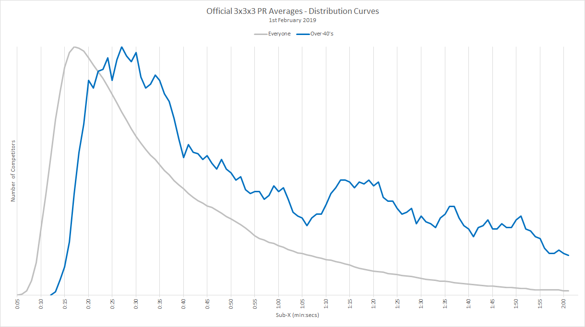

# WCA Proposal for Senior Rankings

## Background

There is a thriving community of senior cubers and the chart below shows how official 3x3x3 averages of the over 40s compare to the overall WCA community when drawn to the same scale.

It is quite striking how the gradients of the leading edges (just left of the apexes) are nearly identical. There is a consistent separation of about 6 seconds which clearly indicates that the over 40s are unable to achieve the times of the younger members in the community. Whether this disparity is due to limited time for practice, slower rate of learning, reduced dexterity, slower reflexes or failing eyesight is unclear but it is probably due to a combination of all these factors.

Knowing that they can't realistically compete with the younger competitors the senior members of the community are extremely keen to see how they rank against their peers. To this end there have been several pieces of analysis in recent years:

* [Partial Over 40s Rankings](Partial_Rankings.md) was only intended to be a one-off but has been maintained since 2015
* [Percentile Rankings](Percentile_Rankings.md) shows how times are distributed for the WCA community and the over 40s
* [Indicative Over 40s Rankings](Indicative_Rankings.md) pads out the partial rankings, thus showing realistic rankings

Whilst these projects are extremely popular with the senior members of the community they have their limitations and it makes sense to provide up-to-date senior rankings on the WCA website.

## Proposal

The nucleus of this proposal is an enhancement to the [Rankings](https://www.worldcubeassociation.org/results/events.php) page on the WCA website. In addition to the current dropdowns (event, region, year, show) it is proposed that "age category" be added for the seniors. Many sports use five year increments for their masters / seniors, typically from age 30 or 35 upwards:

* [Athletics](https://en.wikipedia.org/wiki/Masters_athletics#Age_categories) - 35, 40, 45 ... 100
* [Cycling](https://www.britishcycling.org.uk/road/article/roadst_Road-Categories_Classifications) - 30, 35, 40, 45 ... 75
* [Tennis](https://www.itftennis.com/seniors/rankings/singles-rankings.aspx) - 35, 40, 45 ... 85
* [Rowing](http://www.worldrowing.com/masters/) - (27, 36, 43), 50, 55, 60 ... 80, (83, 86, 89) - slightly different but 50 to 80 are in 5 year increments

Unlike the sports above where people compete directly against each other, WCA age categories do not need to be restricted to specific bandings and do not require an upper age limit for each category.

This proposal is to implement categories for 30+, 40+, 50+, 60+, 70+ and 80+. The results of a 51 year old are intended to appear in the 30+, 40+ and 50+ categories.

TODO - How many people are in these categories?

The existing layout for results / rankings can be retained (rank, person, result, citizen of, competition, result details) but they should only be shown when consent has been given by the competitor. The legal reasons surrounding consent are described in the data protection section of this document.

The numerical "rank" should be based on the results of everyone in the age category (including any hidden results) so that it will be a true representation of overall ranking within the category.

To summarise:

* Propose the addition of "age category" on the existing results page - 30+, 40+, 50+, 60+, 70+ and 80+
* Propose that results be hidden when people have not provided consent
* Propose that "rank" should be based on all results so that it will be a true representation
* Do NOT propose for senior rankings to be regarded as official records
* Do NOT propose for senior rankings to be shown on personal profiles
* Do NOT propose for age or date of birth to be shown on the WCA website
* Do NOT propose for age or date of birth to be included in the public export of the database

## Data Protection / Data Privacy

GDPR compliance should be regarded as the benchmark when it comes to data protection. Article 6 describes the six lawful purposes under which data may be collected and processed, including:

​	*"If the data subject has given consent to the processing of his or her personal data"*

This lawful purpose applies to the collection and processing of any personal data - e.g. name, date of birth (DOB), gender, country of residence and competition results. The WCA needs to ensure that all members consent to the collection and processing of their data regardless of whether they are senior competitors.

It is important that unambiguous consent is provided for the processing of all data by WCA, including a description of how DOB will be used. The recommended approach is to provide the relevant consent (e.g. tick boxes) on the "Privacy Policy" page as well on the "Edit profile" page.

DOB is classified as personally identifiable information (PII) and as such should be well protected. It should be made clear that there is no requirement within this proposal for age or DOB to be shown anywhere on the WCA website or in the public database export.

It must be made clear within the privacy policy that DOB will be used for the age based rankings but that explicit consent must be provided for personal results to be shown in the rankings. The following question could be presented to anyone approaching the age of 30:

​	e.g. *"Do you wish to have your name and results shown in the senior rankings, age 30 upwards? Yes / No"*

Note: It is important for existing members and new members to be asked for their consent and it should be easy to withdraw consent at a later date. This could be done from within the "Privacy Policy" page and / or the "Preferences" tab of the "Edit profile" page. Some existing WCA members may have signed a privacy policy which allows the default to be assumed as "yes" whereas some members will have to start with a default of "no".

For the sake of simplicity, providing consent will apply to all competition results; past, present and future.

As described in the main body of this proposal, names and results will only be shown in the senior rankings where consent has been given so there will be some gaps where consent has not been provided. It is conceivable that the names of unlisted competitors might be identified based on listed results so it would be wise for a Privacy Impact Assessment (PIA) to be completed before implementing this proposal. This is likely to be quite rare and at best give an approximate DOB; some time between two competitions.

One final point to consider is what should be done for deceased people who can't opt in. It would be a shame for their results to be absent and perhaps we can leave this to the discretion of their delegate?

References

* https://www.gdpreu.org/the-regulation/key-concepts/personal-data/
* https://www.gdpreu.org/the-regulation/key-concepts/consent/
* https://www.gdpreu.org/faq/

## Technical Thoughts

The expectation / hope is that much of the code and underlying data used by the "Rankings" page is already suitable for the additional "Age category" option. The [Representative Rankings](Senior_Rankings.md) mentioned earlier rely upon a [data extract](https://github.com/Logiqx/wca-ipy/blob/master/sql/extract_senior_results.sql) which calculates competitor age at the time of the competition. The SQL used for the data extract is probably worth a quick glance, especially regarding the use of TIMESTAMPDIFF().

It is likely to be beneficial if "ageAtComp" is created as an actual column on the "Results" table. This would avoid unnecessarily joins with the "Competitions" and "Persons" table when viewing the rankings, except when checking whether consent has been given by the competitor. It would likely make sense to have this column added to the "Results" table for improved query performance in a number of scenarios, allowing queries to use a simple "where" clause such as "ageAtComp >= 40".

If an "ageAtComp" column is added it can be bulk populated for historical results and either populated at the time of new results being inserted or as a periodic batch process to update recent results. It would also need to be updated when a competitors DOB is changed / updated. The additional field should contain the actual age in years (rather than a specific age category) and should not be shared with the public.

Important: The "ageAtComp" column should not be included on the public export of the database, regardless of who has consented to their name and results appearing in the senior rankings. There is little to no use of exporting the ages of people who have provided their consent as it would only be present for some of the results in the database.
